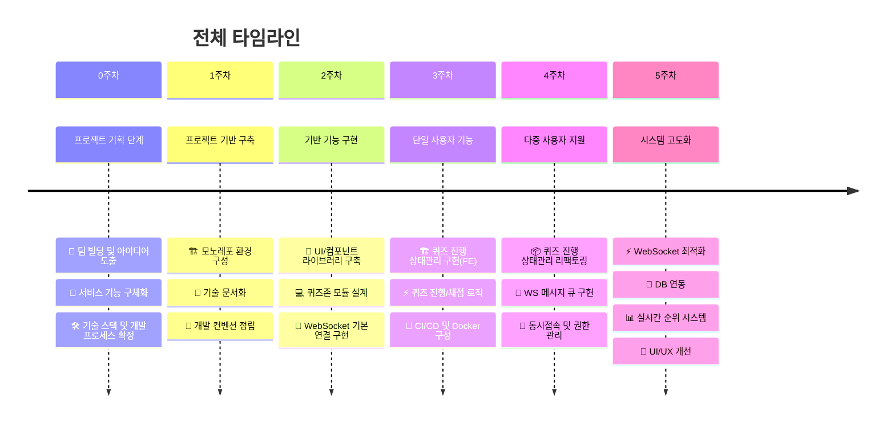
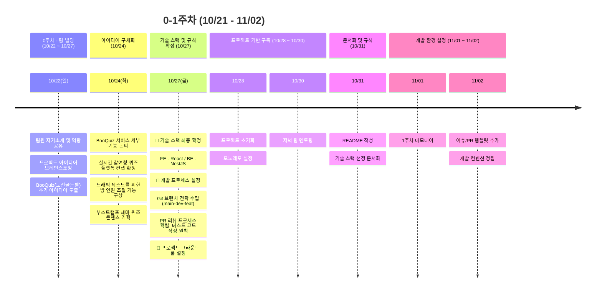
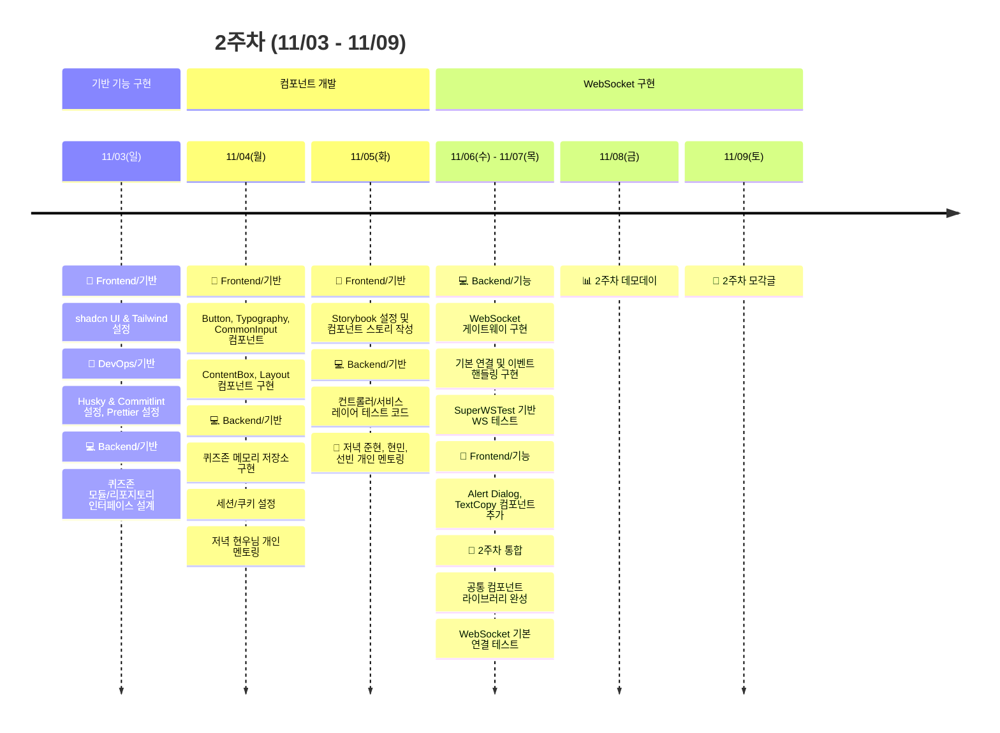
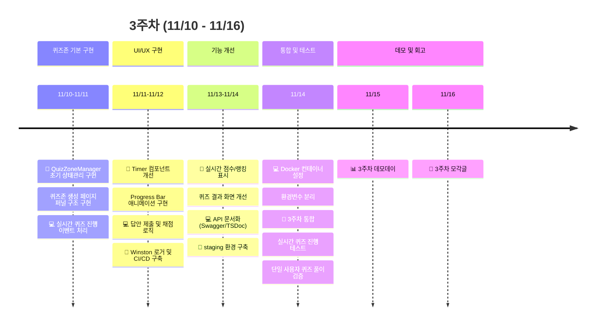
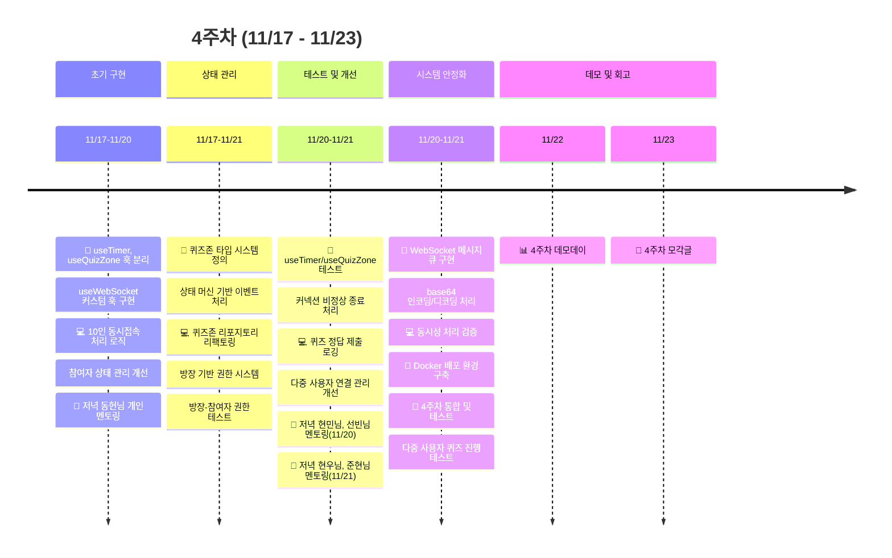
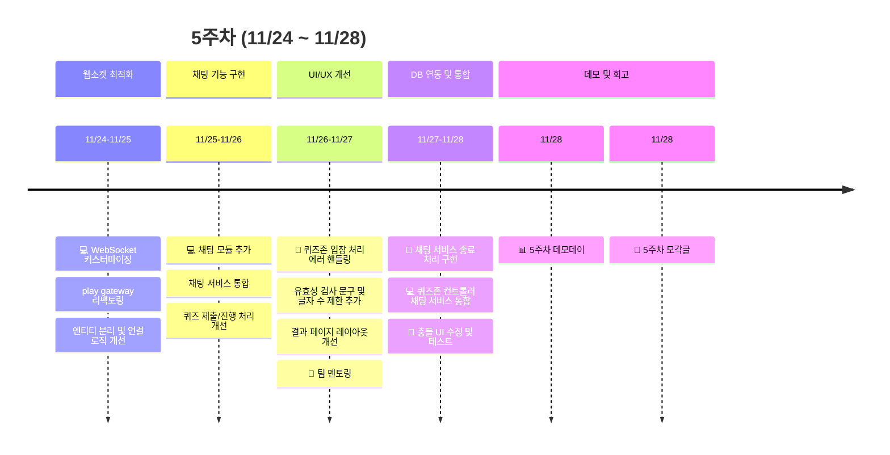
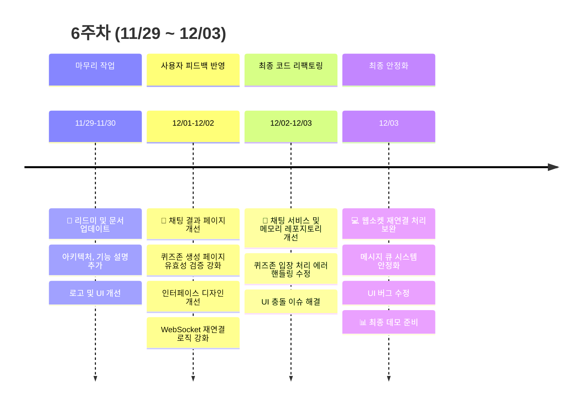
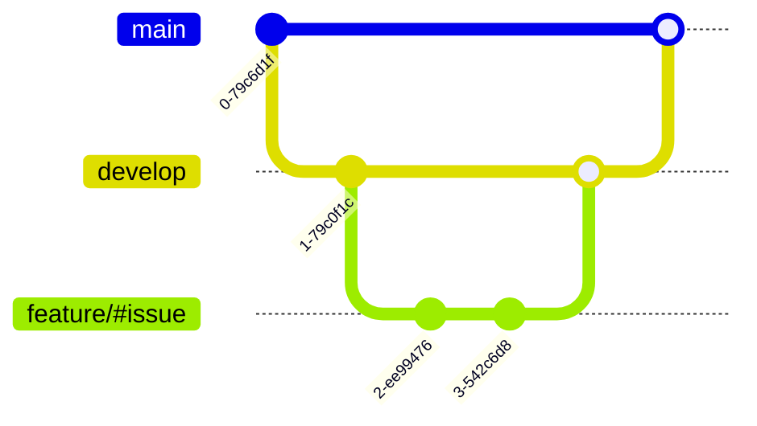

# BooQuiz - 실시간 대규모 퀴즈 플랫폼

[팀 노션](https://www.notion.so/BooQuiz-127f1897cdf5809c8a44d54384683bc6?pvs=21) | [백로그](https://github.com/orgs/boostcampwm-2024/projects/11) | [그라운드 룰](https://github.com/boostcampwm-2024/web08-BooQuiz/wiki/%EA%B7%B8%EB%9D%BC%EC%9A%B4%EB%93%9C-%EB%A3%B0) | [기획서](https://www.notion.so/12cf1897cdf5801487a3dc1438627a99?pvs=21) | [figma](https://www.figma.com/design/1CdBFnF3oWXgAzRdgEhRNU/Web08?node-id=0-1&t=bfZtQb8UJrKIcfTK-1) | [개발위키](https://www.notion.so/12cf1897cdf58093bf0afe75f24401d7?pvs=21)

## 📝 프로젝트 소개

다수의 사용자가 로그인 없이 함께 참여할 수 있는 실시간 퀴즈 플랫폼 BooQuiz 입니다.

## 🚀 프로젝트 목표

> 초기 소규모 서비스에서 시작해 점진적 확장과 기술적 완성도를 함께 추구함

-   **점진적 개발:** 1명 → 10명 → 300명 사용자로 확장하며 매주 완성된 서비스를 배포.
-   **변화 대응:** 주기적인 리팩토링, 아키텍처 조정을 통해 유연성 유지.
-   **협업 강화:** 페어 프로그래밍을 통한 적극적인 협업.
-   **피드백 기반:** 사용자 피드백을 주기적으로 반영.

## 핵심 기능

### 🎯 입장 코드를 통한 간편한 퀴즈 참여


### ⚡ 300명 이상 동시 접속 지원


### 📊 실시간 퀴즈 진행 및 채팅 기능


### 📈 퀴즈존 별 최종 결과 확인


### 🎮 원하는 퀴즈를 직접 만들기


## 🛠 기술 스택

| 영역          | 기술 스택                                                                                                                                                                                                                                                                                                                                                                                                                                                                                                                                                                                                                                                                                                                                                                                                                                                                            |
| ------------- | ------------------------------------------------------------------------------------------------------------------------------------------------------------------------------------------------------------------------------------------------------------------------------------------------------------------------------------------------------------------------------------------------------------------------------------------------------------------------------------------------------------------------------------------------------------------------------------------------------------------------------------------------------------------------------------------------------------------------------------------------------------------------------------------------------------------------------------------------------------------------------------ |
| **공통**      |                                                                                                                                                                                                                                                                                                                                                                                                                                                                                                                                 |
| **Frontend**  |                                                                                       |
| **Backend**   |         |
| **인프라**    |                                                                                                                                                                                                                                                                                             |
| **협업 도구** |                                                                                                  |

## 🏗 시스템 아키텍처


## 📅 개발 타임라인



### 0-1주차: 프로젝트 기획 및 팀 빌딩 (10/22 ~ 10/27)



> 짧은 개발 기간 동안, 실시간 통신 더불어 [팀원의 개인 목표](https://github.com/boostcampwm-2024/web08-BooQuiz/wiki/%ED%94%84%EB%A1%9C%EC%A0%9D%ED%8A%B8-%EA%B0%9C%EC%9D%B8-%EB%AA%A9%ED%91%9C)에 도전해볼 수 있는 프로젝트 기획
> 팀의 주차별 목표 설정을 통해 안정적인 진행과 팀원 동기 부여에 기여.

-   팀원들과 첫 만남에서 각자의 역량과 관심사를 공유하며 프로젝트 방향성 논의.
-   브레인스토밍을 통해 실시간 참여형 퀴즈 플랫폼 아이디어 최종 선정.
-   주차별 현실적인 목표를 설정하여 단계적으로 기능을 확장.
-   매주 데모데이를 통해 실제 배포를 진행하며 프로젝트 발전.

#### 주차 별 배포 목표 설정

-   [마일스톤](https://www.notion.so/130f1897cdf58077bda6da265bd6e55b?pvs=21)
-   [0순위 태스크 목록](https://www.notion.so/0-777fbc00409f4a9683882b2f810245b2?pvs=21)
-   [Github Project 백로그](https://github.com/orgs/boostcampwm-2024/projects/11)

#### 개발 환경 구축

-   **모노레포 구조 도입**
    -   pnpm workspace 적용
-   **코드 품질 관리**
    -   ESLint, Prettier, Git hook
-   **협업 프로세스 확립**
    -   브랜치 보호 규칙 설정, PR 템플릿 도입
-   **프로젝트 개발 환경 구축**
    -   [우리팀이 React를 선택한 이유](https://www.notion.so/React-131f1897cdf5801bb3e5fc02f8c1257b?pvs=21)

### 2주차: 기반 기능 개발 (11/03 - 11/09)



-   개발 환경과 프로세스 안정화, 핵심 기능 구현 기반 마련.
-   페어 프로그래밍 도입으로 지식 공유와 기술적 성장 촉진 향상 촉진.

#### 핵심 구현 내용

1. **프론트엔드**
    - 공통 컴포넌트 라이브러리 구축을 통한 재사용 가능한 UI 패턴 정립
    - Storybook을 통한 컴포넌트 문서화
2. **백엔드**
    - TDD 기반 퀴즈존 모듈 개발
    - WebSocket 게이트웨이 구현
    - 단위 테스트 작성 및 검증

#### 고민 사항

-   [우리는 Vite, StoryBook, Tsdoc을 왜 사용할까?](https://www.notion.so/Vite-StoryBook-Tsdoc-139f1897cdf58069ac4cf71699be8336?pvs=21)
-   [우리팀이 WS를 선택한 이유](https://www.notion.so/WS-aed2e304596f49a08c9aeadc670a2d05?pvs=21)
-   [Nest 의존성 주입](https://www.notion.so/4286fc95e41246ffa6a530d3fe250618?pvs=21)

### 3주차: 단일 사용자 기능 구현 (11/10 - 11/16)



-   퍼널 패턴을 통한 퀴즈 진행 단계별 상태 관리 시스템 구축
-   CI/CD 파이프라인 구성을 통한 지속적인 배포 환경 마련

#### 핵심 구현 내용

1. **프론트엔드**
    - 퍼널 패턴 도입
    - 실시간 타이머 구현
    - 테스트 코드 환경 구축
2. **백엔드**
    - 상태와 이벤트를 기반으로 한 퀴즈 진행 처리 구현
3. **DevOps**
    - Docker, GItHub Actions를 통한 CI/CD 환경 구축

#### 고민 사항

-   [토스의 퍼널 패턴을 퀴즈 상태관리에 적용할 수 있을까?](https://jacky0831.tistory.com/110)
-   [퍼널 패턴으로 퀴즈존 상태관리 하기](https://jacky0831.tistory.com/113)
-   [📚 테스트 코드는 왜 작성해야 할까요? 특히 프론트엔드에서?](https://www.notion.so/140f1897cdf580f68690db6027e73019?pvs=21)
-   [SSL 인증서 발급 및 HTTPS 적용하기](https://www.notion.so/Github-Action-Nginx-69760997c9a64ef289626725db4b29cc?pvs=21)
-   [Github Action으로 Nginx에 정적 파일 배포하기](https://www.notion.so/Github-Action-Nginx-69760997c9a64ef289626725db4b29cc?pvs=21)
-   [github page를 이용하여 정적 페이지 배포](https://www.notion.so/a61a7ca1daec4e28b9b17834366f410a?pvs=21)
-   [Github Action으로 도커 이미지 Web Server 배포하기](https://www.notion.so/04e804ab730e46c1af24786363c3a6c8?pvs=21)
-   [웹소켓 + 리버스 프록시(엔진엑스)](https://www.notion.so/2325bd00d5b04718b295857ff2dbfcef?pvs=21)

### 4주차: 다중 사용자 지원 (11/17 - 11/23)



-   단일 사용자 기능을 다중 사용자 환경으로 확장.
-   백엔드 리펙토링을 통한 실시간 상태 동기화와 메시지 처리 안정성 확보
-   커스텀 훅 재설계로 코드 재사용성 향상.

#### 핵심 구현 내용

1. **프론트엔드**
    - 퀴즈존 상태 관리 커스텀 훅 리팩토링
    - 웹소켓 연결 실시간 동기화 개선
    - 방장/ 참여자 권한 시스템 구현
2. **백엔드**
    - 다중 사용자 퀴즈 진행 처리를 위한 기능 및 구조 확장
    - 사용자 재연결 처리 로직 구현
3. **DevOps**
    - 배포 안전성 확보를 위한 Staging 환경 구축

#### 고민 사항

-   [테스트를 위한 스테이징 환경 구축](https://www.notion.so/a4e628e3a2664f10bc5ccd3915e02436?pvs=21)
-   [useReudcer를 통한 퀴즈 상태관리 커스텀 훅 리팩토링](https://www.notion.so/useReducer-147f1897cdf5805fa3d2fde57bcee23e?pvs=21)
-   [다중 사용자 기능 확장 설계](https://www.notion.so/6b3677b8bc4a4272ba1d47e759e57630?pvs=21)
-   [퀴즈존 상태관리 커스텀 훅을 리팩토링 과정을 돌아보며](https://www.notion.so/151f1897cdf580b39b57d5ee305ab501?pvs=21)
-   [Claude 씨와 리펙토링에 대해서 정량적 평가 해보기](https://www.notion.so/Claude-151f1897cdf580c098e5d492a799aab2?pvs=21)
-   [모놀리식에 Redis가 필요할까?](https://www.notion.so/Redis-2c032b5d95094655b7f9943c1b6d0ba8?pvs=21)
-   [API 서버와 socket 서버의 아키텍처적 분리](https://www.notion.so/API-socket-2c6981d5b7b34559a31f58da6d261a5e?pvs=21)
-   [웹소켓 서버 스케일아웃](https://www.notion.so/a0ab4fe9e8d84245a83057b878a6afe0?pvs=21)
-   [Nest Logger](https://www.notion.so/1e26632868ef4916af8e112d69d4c518?pvs=21)

### 5주차: 시스템 안정화와 서비스 사용성 개선(11/24 ~ 11/27)



-   성능 확인을 위한 부하테스트
-   실시간 채팅과 순위 시스템 추가로 서비스 완성도 향상.

#### 핵심 구현 내용

1. **프론트엔드**
    - 퀴즈존 입장 및 진행 과정에서의 에러 핸들링
    - 채팅 UI 구현 및 전체 레이아웃 개선
    - 퀴즈 제출 페이지별 순위 UI 구현
2. **백엔드**
    - WsAdapter 커스터마이징
    - 퀴즈 진행 중 사용자 상호 작용을 위한 기능 추가
    - 문제별 선착순 제출 순위 산정 구현
    - 퀴즈 목록 관리를 위한 RDB 적용
    - 채팅 이벤트 처리 기능 구현
3. **인프라**
    - Production, Staging MySQL 환경 구축
    - 실시간 모니터링을 위한 WebHook 연동

#### 고민 사항

-   [ErrorBoundary와 Suspense를 통해 에러 처리하기](https://www.notion.so/ErrorBoundary-Suspense-151f1897cdf580b9ac63eb4425c60e75?pvs=21)
-   [리액트 Memoization을 통한 최적화를 하려면?](https://www.notion.so/Memoization-143f1897cdf580c5a1aac108af1a2658?pvs=21)
-   [부하 테스트 시도](https://www.notion.so/c89e88bb9e4b4792bbc9acd310f6bbd4?pvs=21)
-   [NCP 서버 모니터링 with Slack](https://www.notion.so/b003b1f7f8c647d18514d0d75035c5ad?pvs=21)
-   [WsAdapter에 세션 적용하기](https://www.notion.so/ws-d71bf00734b44c28b91853606d14097c?pvs=21)
-   [서버 클라이언트 시간 동기화](https://www.notion.so/257f72a54c6542f0adaaaca679841ab8?pvs=21)

### 6주차 최종 데모 준비



#### 핵심 개선 내용

1. **프론트엔드**
    - 재연결 처리 로직 개선
    - 웹소켓 종료 시나리오 처리 보완
    - 퀴즈존 생성 시 유효성 검증 강화
    - UI/UX 개선 및 채팅,결과 페이지 레이아웃 최적화
    - 에러 메시지 및 안내 문구 개선
2. **백엔드**
    - 채팅 서비스 아키텍처 개선
    - 메모리 레포지토리 CRUD 로직 최적화
    - 퀴즈존 컨트롤러 에러 핸들링 강화
    - 선착순 제출을 고려한 최종 순위 산정

## 🚀 프로젝트 시작하기

1. 레포지토리 클론

```bash
git clone https://github.com/boostcampwm-2024/web08-BooQuiz.git
```

2. 패키지 매니저 설치 (pnpm 사용) 및 패키지 다운로드

```bash
npm install -g pnpm

pnpm install
```

3. Frontend 환경 변수 추가

```bash
echo -e "VITE_API_URL=http://localhost:3000\nVITE_WS_URL=ws://localhost:3000" > /apps/frontend/.env.development
```

2. 프로젝트 실행하기(개발 환경)

```bash
pnpm run start
```

## 📚 프로젝트 구조

```
/
├── frontend/                # 프론트엔드 애플리케이션
│   ├── src/
│   │   ├── blocks/         # 페이지별 주요 컴포넌트
│   │   ├── components/     # 재사용 가능한 컴포넌트
│   │   ├── hook/          # 커스텀 훅
│   │   └── pages/         # 페이지 컴포넌트
│   └── ...
│
├── backend/                 # 백엔드 애플리케이션
│   ├── src/
│   │   ├── common/        # 공통 유틸리티
│   │   ├── core/         # 핵심 기능
│   │   ├── quiz-zone/    # 퀴즈존 상태 정보 관리
│   │   ├── quiz/         # 퀴즈 CRUD
│   │   └── play/         # 실시간 퀴즈 관리
│   └── ...
└── ...
```

## 팀 소개(표인데 얘는 수정하지 말아주세요)

| [J004 강준현](https://github.com/JunhyunKang)             | [J074 김현우](https://github.com/krokerdile)              | [J086 도선빈](https://github.com/typingmistake)            | [J175 이동현](https://github.com/codemario318)             | [J217 전현민](https://github.com/joyjhm)                  |
| --------------------------------------------------------- | --------------------------------------------------------- | ---------------------------------------------------------- | ---------------------------------------------------------- | --------------------------------------------------------- |
|  |  |  |  |  |

## Git Branch 전략

-   GitLab flow를 차용하여 브랜치를 관리하였습니다.



## 🤝 기여하기

1. 이슈 생성 또는 기존 이슈 확인
2. feature/[기능명] 브랜치 생성
3. 개발 및 테스트 완료
4. PR 생성 및 리뷰 요청
