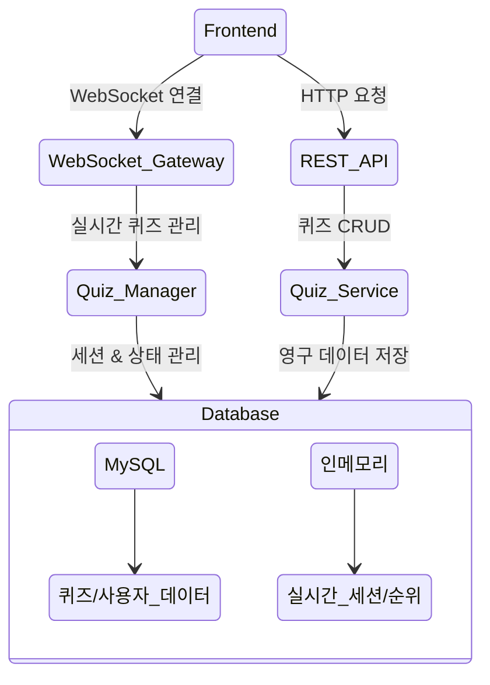

# BooQuiz - 실시간 대규모 퀴즈 플랫폼

<div align="center">
  
  
  [팀 노션](https://www.notion.so/127f1897cdf5809c8a44d54384683bc6?pvs=21) | [백로그](https://github.com/orgs/boostcampwm-2024/projects/11) | [그라운드 룰](https://github.com/boostcampwm-2024/web08-BooQuiz/wiki/%EA%B7%B8%EB%9D%BC%EC%9A%B4%EB%93%9C-%EB%A3%B0)
</div>

## 📝 프로젝트 소개

BooQuiz는 300명 이상의 사용자가 동시에 참여할 수 있는 실시간 퀴즈 플랫폼입니다. 도전 골든벨 형식의 퀴즈를 웹 기반으로 즐길 수 있으며, 실시간 답안 제출과 즉각적인 채점 기능을 제공합니다.

### 핵심 기능

-   🎯 입장 번호를 통한 간편한 퀴즈 참여
-   ⚡ 300명 이상 동시 접속 지원
-   🔄 실시간 답안 제출 및 채점
-   📊 실시간 순위 산정 및 표시
-   🎮 직관적인 UI/UX

## 팀 소개

| [J004 강준현](https://github.com/JunhyunKang)             | [J074 김현우](https://github.com/krokerdile)              | [J086 도선빈](https://github.com/typingmistake)            | [J175 이동현](https://github.com/codemario318)             | [J217 전현민](https://github.com/joyjhm)                  |
| --------------------------------------------------------- | --------------------------------------------------------- | ---------------------------------------------------------- | ---------------------------------------------------------- | --------------------------------------------------------- |
|  |  |  |  |  |

## 🛠 기술 스택

### Frontend

-   **Framework:** React 18.3.1
-   **Language:** TypeScript 5.6.2
-   **Build Tool:** Vite 5.4.10
-   **상태 관리:** React Hooks + Context API
-   **실시간 통신:** WebSocket (ws 8.18.0)
-   **스타일링:** Tailwind CSS, shadcn/ui
-   **테스팅:** Vitest, Testing Library
-   **문서화:** Storybook 8.4.2

### Backend

-   **Framework:** NestJS 10.0.0
-   **Language:** TypeScript 5.1.3
-   **Database:**
    -   MySQL 2 (Production)
    -   SQLite3 (Development)
    -   TypeORM 0.3.20
-   **실시간 통신:** @nestjs/websockets
-   **API 문서화:** @nestjs/swagger 8.0.5
-   **테스팅:** Jest, supertest

## 🏗 시스템 아키텍처



## 🚀 시작하기

1. 레포지토리 클론

```bash
git clone https://github.com/boostcampwm-2024/web08-BooQuiz.git
```

2. 패키지 매니저 설치 (pnpm 사용)

```bash
npm install -g pnpm
```

3. Frontend 설정

```bash
cd frontend
pnpm install
cp .env.example .env
pnpm dev
```

4. Backend 설정

```bash
cd backend
pnpm install
cp .env.example .env
pnpm start:dev
```

## 📚 프로젝트 구조

```
/
├── frontend/                # 프론트엔드 애플리케이션
│   ├── src/
│   │   ├── blocks/         # 페이지별 주요 컴포넌트
│   │   ├── components/     # 재사용 가능한 컴포넌트
│   │   ├── hook/          # 커스텀 훅
│   │   └── pages/         # 페이지 컴포넌트
│   └── ...
│
├── backend/                 # 백엔드 애플리케이션
│   ├── src/
│   │   ├── common/        # 공통 유틸리티
│   │   ├── core/         # 핵심 기능
│   │   ├── play/         # 실시간 퀴즈 관리
│   │   └── quiz/         # 퀴즈 CRUD
│   └── ...
└── ...
```

## 🤝 기여하기

1. 이슈 생성 또는 기존 이슈 확인
2. feature/[기능명] 브랜치 생성
3. 개발 및 테스트 완료
4. PR 생성 및 리뷰 요청
